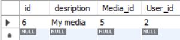
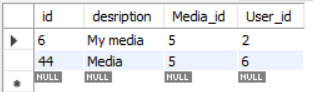

# Тестування працездатності системи

## Значення початкових таблиць

- User

 

    

- Role

    

- Request

    

- Origin

    

- Media

    

- Grant

    

## Робота з User

### Отримання всіх користувачів

    

### Отримати користувача за його id

    

### Додавання нового користувача

    

**Результат додавання нового запису в таблиці:**

    

**При повторному додаванні користувача до таблиці з зареєстрованою електронною поштою, отримаємо помилку:**

    

### Видалення користувача за його id

    

**Результат таблиці після видалення:**

    

**Якщо видалити вже не існуючого користувача, отримуємо помилку:**

    

### Змінити користувачу роль

    

**Результат зміни ролі в користувача:**

    

## Робота з Media

### Додавання нового медіа-контенту

    

**В результаті було додано новий запис в таблицю:**

    

**Якщо додаємо до таблиці медіа-контент з уже існуючим посиланням, отримуємо помилку:**

    

### Здійснення пошуку серед існуючих медіа-контентів за ключовим словом

    

### Видалення медіа-контенту за його id

    

**Результат є видалення відповідного запису з таблиці:**

    

**Якщо видаляємо вже не існуючий медіа-контент, отримуємо помилку:**

    

## Робота з Origin

### Додавання першоджерела

    

**Результат було додано новий запис до таблиці:**

    

**Якщо додаємо до таблиці першоджерело з уже існуючим ім'ям, отримуємо помилку:**

    

### Видалення першоджерела за його id

    

**Результат було видалено відповідний запис з таблиці:**

    

**Якщо видалили уже не існуюче першоджерело, отримуємо помилку:**

    

## Робота з Role

### Додати роль

    

**Результат було додано новий запис до таблиці:**

    

**Якщо додаємо до таблиці роль з уже існуючою назвою, отримуємо помилку:**

    

### Додати до ролі нові права

    

**Результат до поля grants відповідного рядка додано потрібний id дозвіл:**

    

**Якщо додаємо вже додане право, отримуємо помилку:**

    

### Видалити роль за її id

    

**Результат видалено відповідний запис  з таблиці:**

    

**Якщо видаляємо уже не існуючу роль, отримуємо помилку:**

    

## Робота з Request

### Додавання нового запиту

    

**Результат додано новий запис до таблиці:**

    

**Якщо додаємо запит з уже існуючим user id  до таблиці, отримуємо помилку:**

    

### Отримання медіа-контенту за запитом

    

### Видалення запиту за його id

    

**Результат видалено відповідний запис з таблиці :**

    

**Якщо видалити уже не існуючий запит, отримуємо помилку:**

    

