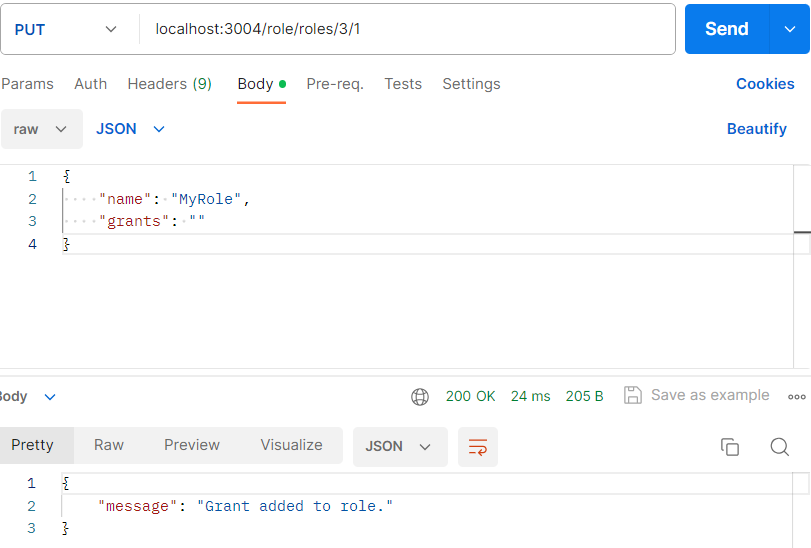
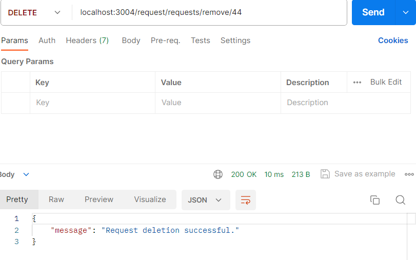
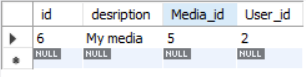

# Тестування працездатності системи

## Значення початкових таблиць

- User

 

## Робота з User

### Отримання всіх користувачів

### Отримати користувача за його id

### Додавання нового користувача

**Результат додавання нового запису в таблиці:**

**При повторному додаванні користувача до таблиці з зареєстрованою електронною поштою, отримаємо помилку:**

### Видалення користувача за його id

**Результат таблиці після видалення:**

**Якщо видалити вже не існуючого користувача, отримуємо помилку:**

### Змінити користувачу роль

**Результат зміни ролі в користувача:**

## Робота з Media

### Додавання нового медіа-контенту

**В результаті було додано новий запис в таблицю:**

**Якщо додаємо до таблиці медіа-контент з уже існуючим посиланням, отримуємо помилку:**

### Здійснення пошуку серед існуючих медіа-контентів за ключовим словом

### Видалення медіа-контенту за його id

**Результат є видалення відповідного запису з таблиці:**

**Якщо видаляємо вже не існуючий медіа-контент, отримуємо помилку:**

## Робота з Origin

### Додавання першоджерела

**Результат було додано новий запис до таблиці:**

**Якщо додаємо до таблиці першоджерело з уже існуючим ім'ям, отримуємо помилку:**

### Видалення першоджерела за його id

**Результат було видалено відповідний запис з таблиці:**

**Якщо видалили уже не існуюче першоджерело, отримуємо помилку:**

## Робота з Role

### Додати роль

**Результат було додано новий запис до таблиці:**

**Якщо додаємо до таблиці роль з уже існуючою назвою, отримуємо помилку:**

### Додати до ролі нові права

**Результат до поля grants відповідного рядка додано потрібний id дозвіл:**

**Якщо додаємо вже додане право, отримуємо помилку:**

### Видалити роль за її id

**Результат видалено відповідний запис  з таблиці:**

**Якщо видаляємо уже не існуючу роль, отримуємо помилку:**

## Робота з Request

### Додавання нового запиту

**Результат додано новий запис до таблиці:**

    ./resources/request/add-request-table.png)

**Якщо додаємо запит з уже існуючим user id  до таблиці, отримуємо помилку:**

### Отримання медіа-контенту за запитом

### Видалення запиту за його id

**Результат видалено відповідний запис з таблиці :**

**Якщо видалити уже не існуючий запит, отримуємо помилку:**

